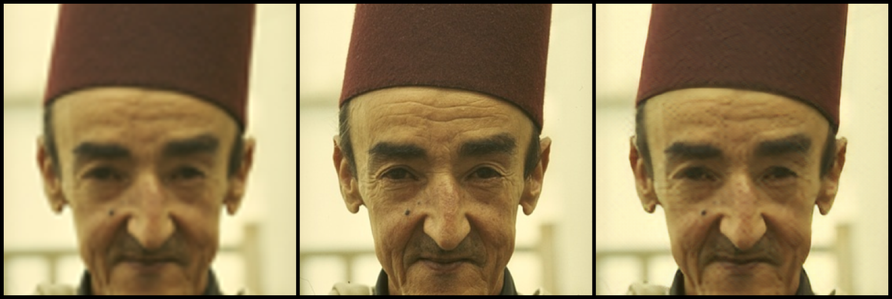
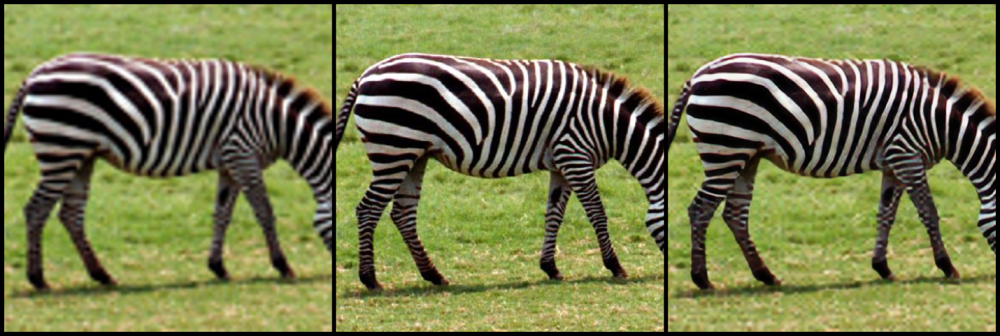

# SRGAN
A PyTorch implementation of SRGAN. For more details, please read
[Photo-Realistic Single Image Super-Resolution Using a Generative Adversarial Network](https://arxiv.org/abs/1609.04802).

## Requirements
To set the conda environment, please use the following commands: 
```
conda install pytorch torchvision -c pytorch
```
- opencv
```
conda install opencv
```

## Usage

### Train
```
python train.py
```

Some useful command line parameters 
```
--crop_size                   training images crop size (default: `90`).
--upscale                     super resolution upscale factor (default: `4`).
--num_epochs                  train epoch number (default: `100`).
```

### Test Single Image
```
python test_image.py
```

Some useful command line parameters 
```
--upscale                     super resolution upscale factor  (default: `4`).
--test_mode                   using GPU or CPU (choices:['GPU', 'CPU'])
--image_name                  test low resolution image name
```

## Benchmarks

**Upscale Factor = 4**

- BSD100_035(PSNR:32.3970; SSIM:0.8532)



- Set14_011(PSNR:29.5974; SSIM:0.9034)


- Set14_014(PSNR:25.1799; SSIM:0.7436)



- Urban100_060(PSNR:20.7729; SSIM:0.5235)


